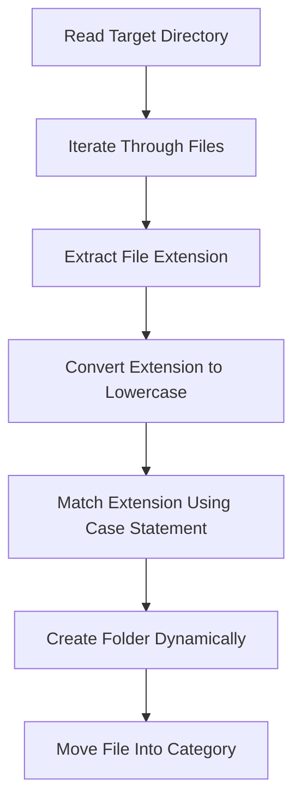

# Linux File Organizer

A Bash-based file organization utility for Linux and WSL environments that automatically categorizes files into structured directories based on file extensions.

---

## Table of Contents

- [Overview](#overview)
- [Features](#features)
- [Supported Categories](#supported-categories)
- [Project Structure](#project-structure)
- [Workflow](#workflow)
- [Technologies Used](#technologies-used)
- [Installation](#installation)
- [Usage](#usage)
- [Sample Output](#sample-output)
- [Bash Concepts Used](#bash-concepts-used)
- [Future Improvements](#future-improvements)
- [Author](#author)

---

## Overview

This project is a Linux shell automation utility developed using Bash scripting.

The script scans files inside a target directory, detects file extensions dynamically, creates categorized folders automatically, and moves files into their corresponding directories.

The project was created to strengthen understanding of:

- Bash scripting
- Linux file handling
- Shell automation
- File system management
- Pattern matching using `case`
- Linux command-line utilities
- WSL integration with Windows file systems

---

## Features

- Automatic file categorization
- Dynamic folder creation using `mkdir -p`
- Case-insensitive extension matching
- Interactive and verbose file movement using `mv -iv`
- Support for a large range of file formats
- Linux and WSL compatible
- Unknown files moved to `others`
- Lightweight and dependency-free

---

## Supported Categories

### Images

```txt
jpg, jpeg, png, gif, bmp, tif, tiff, webp, svg, ico,
heic, heif, raw, cr2, nef, arw, dng, psd, ai,
eps, indd, jfif, avif, apng, ppm, pgm, pbm,
pnm, hdr, exr, xbm, xpm, icns
```

---

### Audio Files

```txt
mp3, wav, flac, aac, ogg, m4a, wma, alac,
aiff, ape, opus, amr, mid, midi, ra, rm,
au, snd, ac3, dts, caf, mka, weba, 3ga
```

---

### Video Files

```txt
webm, mkv, flv, vob, ogv, mov, avi, qt,
wmv, yuv, rm, asf, amv, mp4, m4p, m4v,
mpg, mpeg, mpe, mpv, svi, 3gp, 3g2,
mxf, roq, nsv, f4v, f4p, f4a, f4b, mod
```

---

### Documents

#### PDF Files

```txt
pdf
```

#### Word Documents

```txt
doc, docx, odt, rtf
```

#### Spreadsheet Files

```txt
xls, xlsx, xlsm, xltx, xltm
```

#### Presentation Files

```txt
ppt, pptx, pps, ppsx, odp
```

---

### Compressed Archives

```txt
zip, rar, 7z, tar, gz, bz2, xz,
tgz, iso, cab, lz, lzma,
ace, arj, rpm, deb
```

---

## Project Structure

### Before Organization

```txt
downloads/
├── cat.png
├── music.mp3
├── report.pdf
├── movie.mp4
└── archive.zip
```

### After Organization

```txt
downloads/
├── images/
│   └── cat.png
├── audios/
│   └── music.mp3
├── videos/
│   └── movie.mp4
├── documents/
│   ├── pdfs/
│   │   └── report.pdf
│   ├── word/
│   ├── spreadsheets/
│   └── presentations/
├── zips/
│   └── archive.zip
└── others/
```

---

## Workflow



---

## File Categorization Logic

### Extract Extension

```bash
ext="${file##*.}"
```

---

### Convert Extension to Lowercase

```bash
ext="${ext,,}"
```

This ensures:
- `.PNG`
- `.JPG`
- `.Mp4`

are matched correctly.

---

### Match Extension

```bash
case "$ext" in
```

The script uses Bash pattern matching to identify the correct category.

---

### Create Folder

```bash
mkdir -p "$target/$folder"
```

The `-p` flag:
- creates parent directories automatically
- prevents errors if directories already exist
- allows repeated execution safely

---

### Move Files

```bash
mv -iv "$file" "$target/$folder/"
```

| Flag | Purpose |
|---|---|
| `-i` | Ask before overwrite |
| `-v` | Display movement details |

---

## Technologies Used

- Bash Shell
- Linux Utilities
- Windows Subsystem for Linux (WSL)

---

## Installation

Clone the repository:

```bash
git clone <repository-url>
```

Navigate to the project directory:

```bash
cd file-organizer
```

Make the script executable:

```bash
chmod +x organizer.sh
```

---

## Usage

Run the script:

```bash
./organizer.sh
```

Enter the target directory when prompted.

Example:

```bash
/mnt/c/Users/ADMIN/downloads
```

---

## Sample Output

```bash
$ ./organizer.sh

renamed: cat.png -> images
renamed: music.mp3 -> audios
renamed: report.pdf -> documents/pdfs
renamed: movie.mp4 -> videos
renamed: archive.zip -> zips

Successfully organised!!
```

---

## Bash Concepts Used

| Concept | Usage |
|---|---|
| Loops | Iterating through files |
| Conditional Statements | Checking valid files |
| Case Statements | Extension matching |
| Parameter Expansion | Extracting extensions |
| mkdir -p | Dynamic folder creation |
| mv -iv | Interactive file movement |

---

## Safety Features

> [!IMPORTANT]
> The script uses `mv -i` to prevent accidental overwriting of files.

> [!NOTE]
> Unknown or unsupported file types are automatically moved into the `others` directory.

> [!TIP]
> The script supports case-insensitive extension matching using Bash lowercase conversion.

---

## Future Improvements

- Undo functionality
- Recursive directory scanning
- Real-time monitoring using `inotify`
- Duplicate file detection
- GUI implementation using Python
- Scheduled automation using cron jobs
- AI-based file categorization

---

## Example WSL Path

```bash
/mnt/c/Users/ADMIN/downloads
```

---

## Repository Topics

```txt
bash
linux
shell-script
automation
wsl
file-organizer
linux-project
bash-scripting
filesystem
opensource
```

---

## Author
Developed by Abinaya S as a Linux automation and Bash scripting project.
